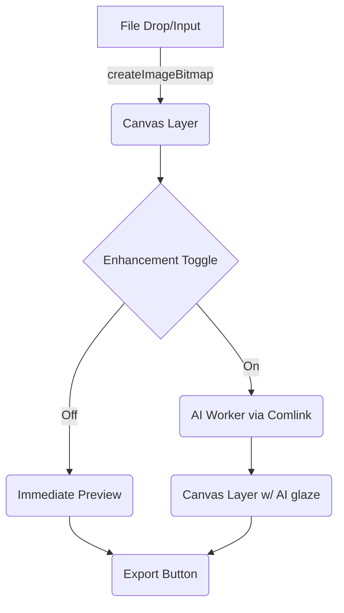

# Client-Only Media Pipeline — 2025 Strategy

> **Mission Update (Nov 20 2025):** The team is pivoting back to *full RAW decode with zero compromise*. This document remains for historical reference (HTML-only experiments) but does **not** satisfy the new “lossless RAW, first-attempt success” requirement. See `RAW_DECODE_ZERO_TO_HERO_PLAN.md` for the active roadmap.

## 1. Status Check (Nov 2025)
- ✅ **LibRaw / WASM stack removed** — no more C++ toolchains, `.wasm` blobs, or worker orchestration to keep alive.
- ✅ **UI simplified** — Tools Library now advertises only HTML-first utilities.
- ❌ **Problem recap**: LibRaw demanded a fragile build, produced grayscale fallbacks, and consumed days of debugging per run. That violates the "first-attempt success" rule.
- 🎯 **Goal**: ship a processing surface that anyone can trust on the first try, with zero local scripts and no dependency on native toolchains.

## 2. Non-Negotiable Constraints
1. **HTML-first**: everything must run via Canvas, ImageBitmap, or Web APIs. No custom WASM builds or native bindings.
2. **Single-command onboarding**: `npm install && npm run dev` must be the whole story.
3. **Client-only AI**: optional enhancements can use WebGPU/WebGL via JavaScript libraries but cannot call external SaaS endpoints.
4. **Graceful fallback**: every stage needs a pure-Canvas code path so low-end devices still work (even if AI extras disable themselves).
5. **Mobile-first**: memory ceiling < 150 MB on 6 GB Android devices; avoid multi-hundred-megabyte buffers.

## 3. Minimal Processing Stack
| Stage | Purpose | 2025 Browser Tech |
| --- | --- | --- |
| **Ingest** | Load JPEG/PNG/HEIC directly | `createImageBitmap`, `ImageDecoder` (WebCodecs), `FileReader` fallback |
| **Canvas Ops** | Resize, crop, color shifts | `OffscreenCanvas`, `CanvasRenderingContext2D`, CSS `filter` presets, `ImageData` math |
| **AI Lift (optional)** | Noise cleanup, vibing filters | `onnxruntime-web` (WebGPU EP), `MediaPipe Image` Tasks, `tfjs` depthwise conv models |
| **Export** | Save PNG/JPEG/WebP | `canvas.toBlob`, `structuredClone` for histories, `navigator.share` when available |

**No RAW ingest**: we only accept already-demuxed formats. Users who need RAW must convert offline (e.g., camera vendor, Adobe DNG converter) before visiting Word Hacker 404.

## 4. Recommended Libraries (all OSS, client-friendly)
1. **`onnxruntime-web@1.18+`** — ships WebGPU + WebAssembly backends, perfect for lightweight enhancement nets (<5 MB) with FP16 weights.
2. **`opencv.js` (official Emscripten build)** — gives us robust convolution, CLAHE, and color conversions without maintaining custom WASM.
3. **`glfx.js` (or similar GLSL filter packs)** — tiny (<30 KB) WebGL filters for blur, vignette, chromatic aberration; zero build steps.
4. **`comlink`** — isolates heavy Canvas/AI work inside a Web Worker with a one-file abstraction while keeping messages type-safe.
5. **`tinycolor2`** — human-friendly color math for HTML controls (tone badges, gradient pickers).

All five ship via npm, work on vanilla Vite, and keep bundle changes explicit.

## 5. Processing Engine Blueprint


Pseudo-sequence for the AI path:
```ts
const bitmap = await createImageBitmap(file)
const base = renderToCanvas(bitmap)

if (settings.aiEnhance) {
  const worker = await workerBridge.prepare()
  const enhanced = await worker.applyModel(base.imageData, {
    model: 'fast-style-transfer.onnx',
    strength: settings.intensity,
  })
  updatePreview(enhanced)
} else {
  updatePreview(base.imageData)
}
```

## 6. Implementation Roadmap
| Phase | Timeline | Deliverable |
| --- | --- | --- |
| **P0 — Reset (Done)** | Immediate | Delete LibRaw stack, remove scripts, trim CSS, update README. |
| **P1 — Canvas Utility Pack** | 2–3 days | Build ingest + preview components, expose crop/rescale + tone slider using pure Canvas. |
| **P2 — AI Booster (optional)** | 1 week | Integrate `onnxruntime-web` with a 3–5 MB ONNX model (e.g., color boost, denoise). Runs inside a worker; auto-disables on low-memory devices (`navigator.deviceMemory < 4`). |
| **P3 — Publishing UX** | 2 days | Export to PNG/JPEG/WebP, add share sheet + metadata summary (word tags, tone badges). |
| **P4 — Diagnostics-lite** | 1 day | Simple console reporter (no IndexedDB vault). Captures stage durations + AI toggle state for copy/paste bug reports. |

## 7. Guardrails & Quality Gates
- **Color accuracy**: reuse the existing variance heuristic on the final Canvas buffer; block export if <30 % colorful pixels.
- **Performance budget**: AI worker must return within 1.5 s on M1/Chrome and 3 s on Pixel 7; otherwise auto-fallback to Canvas-only.
- **Bundle size**: keep incremental JS under +300 KB gzipped. Load ONNX weights via `fetch` when the user toggles enhancement.
- **Accessibility**: respect `prefers-reduced-motion`, ensure keyboard + screen-reader flows for uploads and previews.
- **Telemetry (optional)**: log anonymized stage timings only when user opts in; no file contents leave the browser.

## 8. Immediate Next Steps
1. **Design HTML components** for the new "Image Lab" (upload card, preview, enhancement toggle) — no dependency on removed modules.
2. **Prototype Canvas-only pipeline** in `src/components/ToolsPage` (replace the disabled button with a simple working utility).
3. **Select ONNX model** (<5 MB) that actually runs on WebGPU (e.g., `fast-style-transfer` or `colorizer-lite`). Document prompts + licensing in `/docs/models.md`.
4. **Add feature flag hooks** so AI features can be toggled via query param or system bar switch.

> This document replaces every `RAW_CONVERTER_*.md` file. Future contributors should reference this plan before adding any imaging or AI tooling so we never drift back to the heavy LibRaw approach.
