# Elite Indexing Speed: Optimization Plan & Post-Mortem

## 1. Post-Mortem: Why the Previous Attempt Failed
We encountered three specific failure modes during the optimization attempt. This logic breakdown explains why the user saw "0 Items" and "Nothing check".

### A. The "Disconnect" (Root Cause of "Old Speed")
*   **Issue:** The Tauri command `build_index` was effectively a "stub". It did not call the newly written `build_index_internal` function where the optimization lived.
*   **Impact:** The application continued using the old, slow method (or nothing at all) despite the new code existing in the file.
*   **Lesson:** Always verify the "wiring" from the frontend command (`lib.rs`) to the internal logic handler first.

### B. The "Silent Failure" (Root Cause of "0 Items")
*   **Issue:** The MFT Scanner (usn-journal-rs) successfully opened the Volume handle but found 0 valid entries (likely due to an uninitialized journal on the specific drive or an Admin permission quirk).
*   **Critical Bug:** The code treated `Ok(0 files)` as a Success.
*   **Logic:** "Did the scan error? No. Okay, we are done."
*   **Result:** The fallback mechanism (JWalk) was skipped because the system thought it succeeded.
*   **Fix:** The scanner MUST treat "0 items" as a critical failure condition (Err) to trigger the safety net.

### C. Compilation Instability
*   **Issue:** Frequent, overlapping edits to `build_index` resulted in duplicate `#[tauri::command]` attributes and syntax errors.
*   **Lesson:** When editing high-traffic functions, replace the entire function body rather than patching small chunks to ensure structural integrity.

---

## 2. The "Elite" Architecture (Future-Proof Plan)
To implement the "Elite Speed" (MFT) feature successfully, we must use a **Hybrid Fail-Safe Architecture**. This ensures the user always gets results, regardless of whether MFT works.

### Architecture Diagram

```mermaid
graph TD
    A[User Clicks 'Build Index'] --> B{Is Admin?}
    B -- No --> C[Standard JWalk Scan]
    B -- Yes --> D[Attempt MFT Scan]
    D --> E{Result > 0 Files?}
    E -- Yes --> F[🚀 Elite Success]
    E -- No/Err --> G[⚠️ Fallback Triggered]
    G --> C
    C --> H[✅ Index Complete]
    F --> H
```


### Key Technical Requirements
1.  **Admin Check:** Explicitly check `is_elevated()` before even trying MFT.
2.  **Volume Discovery:** Use `sysinfo` to find all physical NTFS drives (Exclude network/virtual drives).
3.  **Journal Initialization:** If the USN Journal is not active, the app must create it using fsutil commands or the crate's `create_journal` API (requires heavy risk management).
4.  **The "Sentinel" Check:** If the scan returns < 100 items on a C: drive, assume failure and force fallback.

---

## 3. The Robust Implementation (Code Blueprint)
Use this exact logic structure for the next implementation attempt. It solves the "Silent Failure" bug.

### A. The Hybrid Scanner (`lib.rs`)
// The "Brain" of the operation
```rust
fn build_index_internal(&mut self, drives: Vec<String>) -> Result<String, String> {
    
    // 1. Safety Check
    if !am_i_elevated() {
        println!("🔒 [Hunter] Not Admin. Forcing Standard JWalk.");
        return self.run_jwalk_scan(drives);
    }

    let mut all_files = Vec::new();
    let mut any_mft_success = false;

    // 2. Elite Scan Attempt
    for drive in &drives {
        match self.try_usn_scan(drive) {
            Ok(files) => {
                if files.is_empty() {
                    // CRITICAL FIX: Treat empty as failure
                    println!("⚠️ [Hunter] MFT returned 0 files for {}. Falling back.", drive);
                    let jwalk_files = self.scan_drive_jwalk(drive)?;
                    all_files.extend(jwalk_files);
                } else {
                    // Success
                    println!("🚀 [Hunter] MFT Success for {}: {} items", drive, files.len());
                    all_files.extend(files);
                    any_mft_success = true;
                }
            },
            Err(e) => {
                // Expected Fallback (e.g., FAT32 drives / Permission Denied)
                println!("⚠️ [Hunter] MFT Failed for {}: {}. Falling back.", drive, e);
                let jwalk_files = self.scan_drive_jwalk(drive)?;
                all_files.extend(jwalk_files);
            }
        }
    }
    
    Ok(format!("Indexed {} files.", all_files.len()))
}
```

### B. The "MFT Native" Function
Correctly handling the `usn-journal` crate.

```rust
fn scan_mft_native(drive_path: &str) -> Result<Vec<FileInfo>, String> {
    use usn_journal_rs::journal::UsnJournal;
    use usn_journal_rs::volume::Volume;

    // 1. Mount Point Correction
    let volume_path = format!("{}\\", drive_path.trim_end_matches('\\')); // "C:\"
    
    // 2. Open Volume
    let volume = Volume::from_mount_point(std::path::Path::new(&volume_path))
        .map_err(|e| format!("Volume Access Denied: {:?}", e))?;
    
    // 3. Open Journal
    let journal = UsnJournal::new(&volume);
    
    let mut files = Vec::new();

    // 4. Iterate (With Timeout/Limit for safety)
    for block in journal.iter() {
        for record in block {
            if let Ok(entry) = record {
                let name = entry.file_name.to_string_lossy().to_string();
                let is_dir = (entry.file_attributes & 0x10) != 0;
                
                // MFT only gives us minimal info fast. Size/Modified might require extra lookup
                // but for "Search", Name + Path is enough.
                files.push(FileInfo {
                   name: name.clone(),
                   path: name, // Note: USN gives Name, not Full Path. 
                               // Real implementation needs 'parent_file_reference_number' map 
                               // to reconstruct full paths.
                   is_dir,
                   size: 0, 
                   modified: 0 
                });
            }
        }
    }

    // 5. Verification
    if files.len() < 50 {
        return Err("Journal Empty or Invalid".to_string());
    }
    
    Ok(files)
}
```

### Note on "Full Paths"
**Important:** The `usn-journal` crate returns file names, not full paths. To get full paths (e.g., `C:\Users\You\File.txt`), the "Elite" engine must build a `HashMap<u64, u64>` (Node ID -> Parent ID) and reconstruct paths. This missing logic is likely why you saw "0 items" or weird names—without path reconstruction, the files exist but have no valid `path` string to display in the UI.

---

## 4. Summary
To fix this permanently:

1.  **Revert** to the stable JWalk version (as you have done).
2.  **Next Attempt:** Must implement **Parent ID Path Reconstruction** (without it, MFT is useless for search).
3.  **Fallback:** Must strictly fall back to JWalk if MFT returns < 50 items.

This plan ensures the next attempt will be stable, functional, and astronomically fast.
